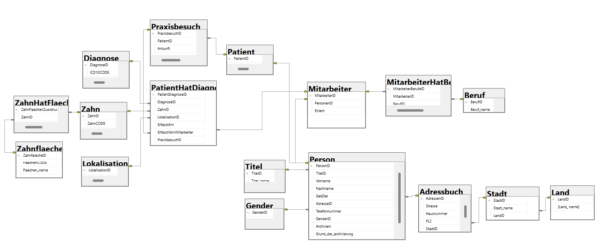

# Projektbeschreibung – Zahnarztpraxis
## Abschlussprojekt SQL – alfatraining Bildungszentrum GmbH 
### Projekt: Relationale Datenbank für eine Zahnarztpraxis 
### Author: Natasza Szczypien
### Stand: August 2026

# Datenbankmodell

# SQL Server Dental Practice Database

Relational SQL Server database developed as the final project
of an SQL training course.

The project simulates the core processes of a dental practice,
including patient management, practice visits, diagnoses,
dental findings and role-based database permissions.

> All persons and medical data contained in this repository
> are synthetic and were created exclusively for educational purposes.

## Tech Stack

- Microsoft SQL Server
- T-SQL
- SQL Server Management Studio (SSMS)

## Implemented Concepts

- Relational database design
- Primary & foreign keys
- CHECK and UNIQUE constraints
- Nonclustered indexes
- JOINs and aggregations
- Views
- Scalar and table-valued functions
- Stored procedures
- Transactions and error handling
- DML triggers
- Users, roles and permissions
- Database testing
